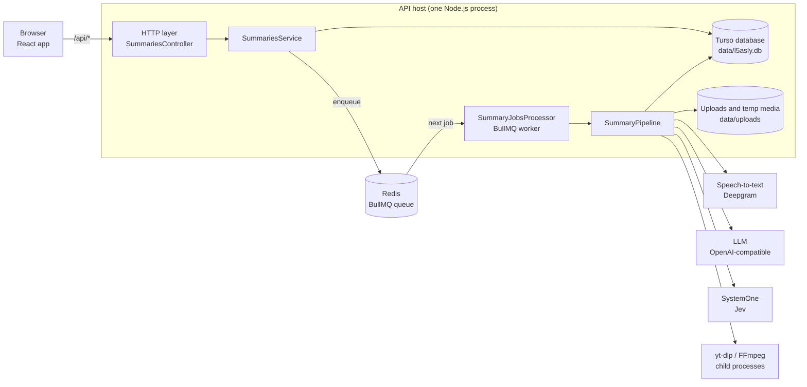
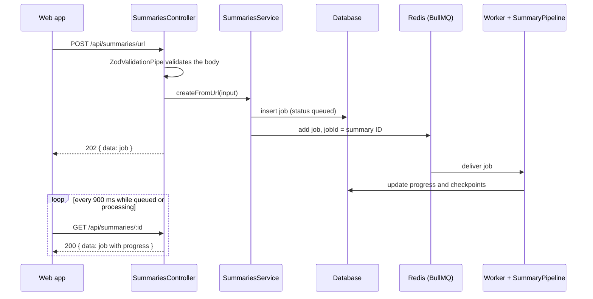

# Architecture overview

L5asly is one NestJS API process, a React single-page app, a Redis-backed job queue, and an embedded database. Summarizing a video takes minutes, so the API never does it inside an HTTP request. It records a job, queues it, and the web app polls until the job finishes.

## System diagram

The worker runs in the same process as the HTTP API. BullMQ would also allow it to run as a separate process, but nothing in the codebase does that today.

The API serves only `/api`. In production, the `web` container (nginx) serves the built web app and proxies `/api` to the API; see `compose.yaml`. In development, Vite serves it and proxies `/api` to the API.

## Request flow: creating a summary

Uploads follow the same path through `POST /api/summaries/upload`. Multer writes the file to `UPLOAD_DIR` first, and the upload pipes check it before the service sees it.

## Layers in the API

| Layer | Owns | Must not |
| --- | --- | --- |
| Controller | Routes, status codes, attaching pipes and interceptors | Contain business rules or touch the database |
| Pipes and interceptors | Validating and normalizing input, deleting rejected uploads, wrapping responses | Make business decisions |
| Services | Business rules: job lifecycle, retry eligibility, the processing steps | Know about HTTP request or response objects |
| Repository | SQL and mapping between rows and domain objects | Contain business rules |
| Providers | Calling an external service and validating its response | Know about jobs or the database |

`SummariesService` handles the API-facing job lifecycle: create, read, cancel, retry, delete, and media cleanup. `SummaryPipeline` handles processing. The two share the repository, but neither calls the other.

## Key decisions

| Decision | Why | Trade-off |
| --- | --- | --- |
| Process jobs in a BullMQ queue | Processing takes minutes and must survive slow providers; jobs are stored durably in Redis | Redis becomes a required dependency |
| Process one job at a time | Matches the original in-process runner and keeps provider usage predictable | A second job waits for the first. See the [optimization review](../proposals/optimization-review.md) |
| Checkpoint after each step | A retry resumes from the failed step instead of downloading and transcribing again | Checkpoints store the full transcript as JSON |
| Turso embedded database | SQLite-compatible, no separate server, async API | Single host. Several API instances would need a shared database |
| Abstract classes as provider contracts | They work as Nest injection tokens, so mock and live implementations swap without changing callers | One more file to read when you follow a call |
| Shared Zod contracts package | One schema validates requests on the server and responses in the browser | Every API change touches the contracts package first |
| `@nestjs/http-client` for all outbound HTTP | Typed errors, per-request timeouts, and named clients, without the Axios dependency | The package is very new (0.0.1) |

## Limits of the current design

- One API host. Uploaded media, the database file, and the in-memory `recoveryInProgress` guard in `SummariesService` all assume a single process.
- Startup waits for Redis. The process does not fail fast when Redis is unreachable.
- Clients learn about progress by polling. There is no push channel.

These items, and the work they would need, are tracked in the [optimization review](../proposals/optimization-review.md).
