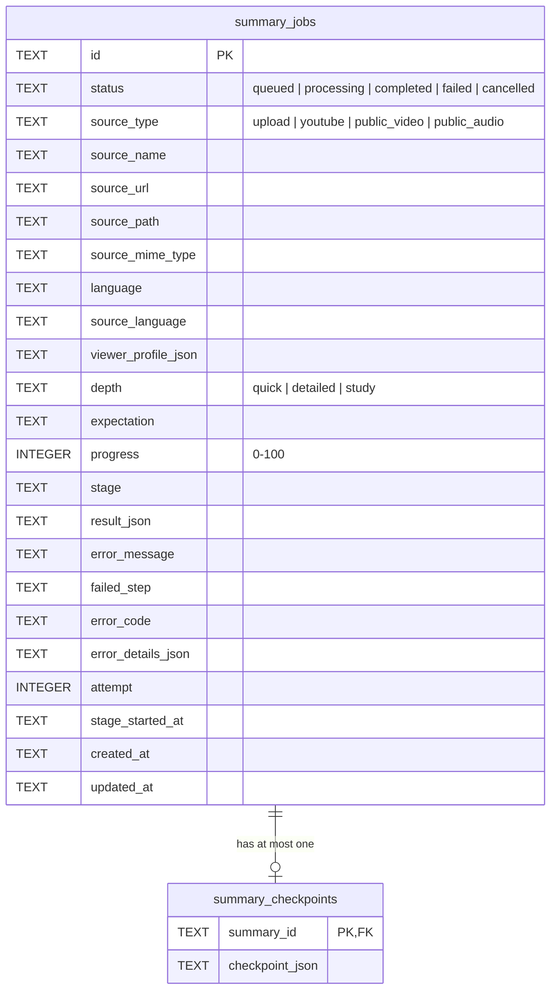

# Persistence

Jobs and checkpoints are stored in an embedded [Turso](https://github.com/tursodatabase/turso/tree/main/bindings/javascript) database (`@tursodatabase/database`). Turso is SQLite-compatible, runs inside the API process, and writes a single file at `DATABASE_PATH` (default `./data/l5asly.db`). Its JavaScript API is fully async.

Code: `apps/api/src/database/` and `apps/api/src/summaries/summary.repository.ts`.

## Connection

`DatabaseModule` is global. It opens one connection with `openDatabase(path)`, provides it under the `DATABASE` token, and closes it when the app shuts down. Inject it with `@Inject(DATABASE) database: Database`. Only repositories should do this.

Tests open their own connection with `openDatabase(":memory:")`.

## Schema

- `CHECK` constraints enforce the enum columns and the progress range. Another `CHECK` requires `source_url` for every link source and forbids it for uploads.
- `summary_checkpoints` uses `ON DELETE CASCADE`, so deleting a job deletes its checkpoint. Foreign keys are switched on at connection time.
- `result_json` holds the full `SummaryResult` from the contracts package, including the transcript.
- `checkpoint_json` follows `summaryCheckpointSchema` in `summary-checkpoint.ts`.
- Timestamps are ISO 8601 strings.

## Schema upgrades

There is no migration tool. `openDatabase` runs on every startup and:

1. creates the tables and indexes with `CREATE ... IF NOT EXISTS`;
2. reads `PRAGMA table_info(summary_jobs)` and adds each column from the `addedColumns` list that is missing.

To add a column, append it to `addedColumns` in `database/database.ts`. The upgrade must be additive and safe to run again. A new `NOT NULL` column needs a `DEFAULT`. Existing rows must keep working, so make the repository mapping handle the old shape (see how `source_language` falls back to `language`). `database/tests/database.test.ts` checks that an old database upgrades without losing data. Extend it when you add a column.

Renaming or dropping columns isn't supported by this approach. Discuss it in an issue first.

SQLite can't change a `CHECK` constraint in place. When `source_type` gained the `youtube`, `public_video`, and `public_audio` values, `upgradeSourceTypes` rebuilt the table once: it copies every row into a new table, reclassifies each old `url` row with `describeUrlSource`, then swaps the tables inside one transaction. Foreign keys are switched off for the swap, because dropping the old table would otherwise cascade-delete every checkpoint. It detects an upgraded table from its stored `CREATE TABLE` SQL, so it runs only once. Old YouTube rows keep their stored host name, since the title is only known after a download.

## Repository rules

`SummaryRepository` is the only code that runs SQL against these tables.

- **Validate on read.** Rows come back as `unknown`, and each one is parsed with `summaryRowSchema`. JSON columns are parsed and validated with their contract schemas.
- **Map explicitly.** `mapRow` builds a `StoredSummaryJob`, and `SummariesService.toPublicJob` builds the public `SummaryJob`. Internal fields such as `sourcePath` and `sourceMimeType` never reach the API response. `source_url` does: link sources return it as `source.url` so users can open the original media.
- **Guard state changes in SQL.** Status changes include a `WHERE status ...` condition, for example `complete` doesn't overwrite a cancelled job, and `retry` only updates a failed one. Callers check `changes` when they need to know whether the update applied.
- **Use transactions for multi-statement writes.** `retry` uses `database.transactionAsync(...).immediate()`. It reserves the connection, so statements from other requests can't run in the middle of the transaction. Keep transactions short, and never call a provider or the queue inside one.
- **Parameterize everything.** Use `?` placeholders. Never build SQL from values with string interpolation.

The repository is created by a factory in `summaries.module.ts` rather than by `@Injectable()`. The factory also runs `failInterruptedJobs()` once before the queue worker starts (see [Summary jobs](summary-jobs.md#restarts)).

## Files on disk

Uploads, downloaded YouTube audio, and extracted audio are stored in `UPLOAD_DIR`. The database stores their paths, never their contents. [Summary jobs](summary-jobs.md#media-cleanup) explains when each file is deleted.
