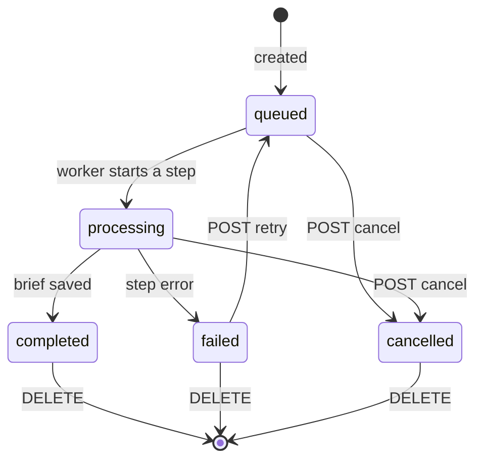

# Summary jobs

A summary job is one row in `summary_jobs`, plus one BullMQ job that tells the worker to process it. This page follows a job from creation to completion, failure, retry, and cleanup.

Code: `apps/api/src/summaries/jobs/`, `services/summary-pipeline.service.ts`, `services/summaries.service.ts`.

## Job states

The `status` column is the source of truth. A BullMQ job only says "process this summary ID now".

## The queue

| Piece | File | Role |
| --- | --- | --- |
| `SummaryQueue` | `jobs/summary-queue.ts` | Abstract contract: `enqueue(id)` and `isProcessing(id)`. Services depend on this. |
| `BullSummaryQueue` | `jobs/summary-queue.ts` | BullMQ implementation. It also registers the hourly cleanup scheduler on startup. |
| `SummaryJobsProcessor` | `jobs/summary-jobs.processor.ts` | The worker. It switches on the job name and validates the job data with Zod. |

There is one queue, `summaries`, with two job names:

- `process-summary`: data `{ summaryId }`. The summary ID is also used as the BullMQ job ID, so a summary that is already waiting is not queued twice. Finished jobs are removed from Redis.
- `cleanup-expired-media`: created every hour by a BullMQ job scheduler.

The worker runs with BullMQ's default concurrency of 1, so jobs run one at a time. A cleanup job waits behind a running summary.

## Processing steps

`SummaryPipeline.process(id)` runs the steps below. It only starts when the row is still `queued`.

| Progress | Stage text | Step | Checkpoint saved |
| --- | --- | --- | --- |
| 12 | Preparing media | Use the upload, or download YouTube audio (live mode) and store the video title as the source name, then extract audio with FFmpeg when the source is a video. Other URLs are passed to speech-to-text as is, without a download | `preparedMedia`, `mediaExpiresAt` |
| 18 | Downloading audio from YouTube | Live mode only | (same as above) |
| 34 | Transcribing speech | Speech-to-text in the job's source language | `transcription` |
| 68 | Generating the brief | Three calls in parallel: the summary (then a grounding check), the watch verdict, and the relevance timeline | `summary`, `verdict`, `timeline`, each when it finishes |
| 100 | Summary ready | Save the result and delete the checkpoint | (checkpoint cleared) |

Only the summary is required. When the other parallel calls fail:

- **Verdict fails:** the job completes with a provisional verdict, built from the brief, and a caveat that says so.
- **Timeline fails:** the job completes without a timeline.
- **Grounding check fails:** the job completes with key points that have no "supported" or "unsupported" flag.

Between steps, the pipeline re-reads the job's status. If the job was cancelled, it stops and removes temporary media. A provider call that is already running is not interrupted.

## Failures and checkpoints

When a step throws, the job is marked `failed` with:

- `failedStep`: `media`, `transcription`, or `summary`
- `errorCode` and `error`: from the `AppError`, or `PROCESSING_ERROR` for an unexpected error
- `errorDetails`: field-level details, for example from an invalid LLM response

The checkpoint is kept, so a retry can skip finished steps. Media is kept for a retry only when no transcript was saved yet. Otherwise it is deleted right away, because a summary retry no longer needs it.

## Retries

`POST /api/summaries/:id/retry` works only on `failed` jobs. `SummariesService.getRetryInfo` decides where the retry starts:

1. **A transcript checkpoint exists:** restart at `summary`. Download and transcription are skipped, and so are any verdict or timeline already saved.
2. **Prepared media exists and has not expired:** restart at `transcription`.
3. **Otherwise:** restart at `media`. For an upload whose file is gone or expired, the client must send the same file again in the `video` field (`REUPLOAD_REQUIRED` otherwise).

A retry keeps the job ID, options, and viewer profile snapshot, and increments `attempt`. The web app shows `retryInfo.reason` to explain what a retry will do.

Two guards prevent conflicting changes:

- `SummaryQueue.isProcessing(id)` returns `JOB_BUSY` while the worker is still finishing the previous attempt.
- `recoveryInProgress` in `SummariesService` blocks a retry, delete, or cleanup of the same job at the same time. It is an in-memory set, so it only protects a single API process.

## Restarts

When the API starts, `SummaryRepository` is created through an async factory in `summaries.module.ts` that first calls `failInterruptedJobs()`. Every job still `queued` or `processing` becomes `failed` with `JOB_INTERRUPTED`, and its `failedStep` is inferred from its progress. Providers are built before any BullMQ worker starts, so the worker can't pick up one of these jobs halfway through recovery. Users retry interrupted jobs from the UI.

## Media cleanup

Retry media expires 24 hours after it was prepared (`RETRY_MEDIA_RETENTION_MS` in `summary-checkpoint.ts`). The hourly `cleanup-expired-media` job deletes expired files for failed jobs and clears them from the checkpoint. Saved transcripts are kept until the job is deleted.

`DELETE /api/summaries/:id` removes the row, its checkpoint (through `ON DELETE CASCADE`), and any retained files. Queued and processing jobs must be cancelled first.
